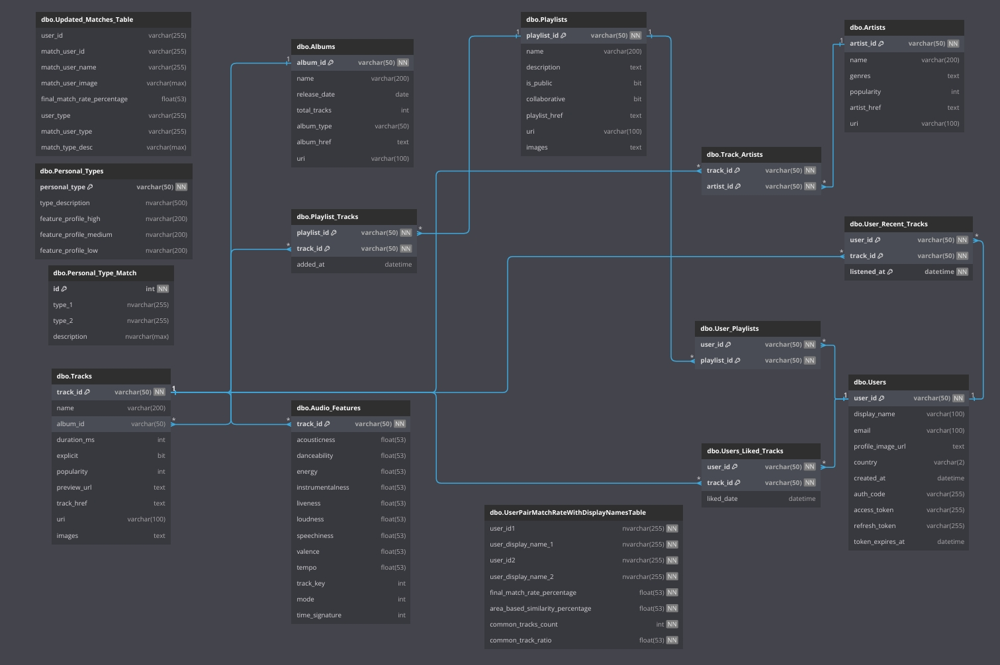

# **SYNCBRANCH PROJE DOKÜMANTASYONU**

## 1. Başlık Sayfası
- **Proje Adı**: SyncBranch  
- **Sürüm Numarası**: v0.9  
- **Doküman Sahibi**: Proje Yöneticisi / Scrum Master  
- **Son Güncelleme Tarihi**: 2024-12-29  
- **Onaylayanlar**: (İlgili departman veya ekip yöneticileri)

---

## 2. Revizyon Geçmişi

| **Versiyon** | **Tarih**       | **Yazar**                    | **Açıklama**                                     |
|--------------|-----------------|------------------------------|-------------------------------------------------|
| 0.2          | 2024-10-31      | Proje Yöneticisi (PM)        | Başlangıç dokümanı                              |
| 0.5          | 2024-11-10      | Teknik Ekip (Backend/Frontend)| Gereksinim ve mimari güncellemeler             |
| 0.9          | 2024-12-29      | Teknik Ekip (Backend/Frontend)                          | Detaylandırılmış Gereksinim ve Mimari Güncellemeleri                                             |

---

## 3. İçindekiler
1. [Başlık Sayfası](#1-başlık-sayfası)  
2. [Revizyon Geçmişi](#2-revizyon-geçmişi)  
3. [İçindekiler](#3-İçindekiler)  
4. [Giriş](#4-giriş)  
5. [Proje Genel Bakış](#5-proje-genel-bakış)  
6. [Gereksinimler](#6-gereksinimler)  
7. [Kullanım Senaryoları ve Kullanıcı Hikayeleri](#7-kullanım-senaryoları-ve-kullanıcı-hikayeleri)  
8. [Sistem Mimarisi](#8-sistem-mimarisi)  
9. [Detaylı Tasarım ve Uygulama](#9-detaylı-tasarım-ve-uygulama)  
10. [Test Stratejisi](#10-test-stratejisi)  
11. [Dağıtım ve Sürüm Yönetimi](#11-dağıtım-ve-sürüm-yönetimi)  
12. [Bakım ve Destek](#12-bakım-ve-destek)  
13. [Risk Yönetimi](#13-risk-yönetimi)  
14. [Proje Yönetimi ve Yönetişim](#14-proje-yönetimi-ve-yönetişim)  
15. [Ekler (Appendices)](#15-ekler-appendices)  
16. [Terimler Sözlüğü](#16-terimler-sözlüğü)

---

## 4. Giriş

### 4.1 Proje Arka Planı
**SyncBranch**, müzik dinleme alışkanlıklarını analiz ederek kullanıcıların kişisel profillerini ortaya çıkaran, bu veriler üzerinden kullanıcıları eşleştiren ve böylece sosyal bir platform oluşturan yenilikçi bir **mobil uygulamadır**. Proje; insanların müzik tercihlerinden yola çıkarak kendilerini ifade edebilecekleri, yeni insanlarla tanışabilecekleri ve müzikle etkileşimi artıracak bir ortam oluşturma fikrinden doğmuştur.

### 4.2 Amaç ve Hedefler
- **Müzik Verisi Analizi**: Kullanıcıların dinleme alışkanlıklarından veri toplayarak, bu verilerin işlenip anlamlı içgörülere dönüştürülmesi.  
- **Sosyal Eşleştirme**: Benzer müzik zevklerine veya benzer kişilik özelliklerine sahip kullanıcıları birbirine önermek.  
- **Kullanıcı Deneyimi**: Basit, sezgisel ve kullanıcı dostu bir arayüz ile her türden kullanıcının rahatça kullanabileceği bir platform oluşturmak.  
- **Güvenlik**: Kullanıcı verilerinin güvenliğini sağlamak için güçlü doğrulama, şifreleme ve koruma önlemleri uygulamak.

### 4.3 Paydaşlar ve Hedef Kullanıcılar
- **Paydaşlar**  
  - **Uygulama Geliştirme Ekibi**: Backend/Frontend geliştiriciler, veri mühendisleri, UX/UI tasarımcıları.  
  - **Proje Yönetimi**: Scrum Master, Proje Yöneticileri.  
- **Hedef Kullanıcılar**  
  - Müzik tutkunları, yeni müzik keşfetmek isteyenler, müzikle kendini ifade etmeyi seven herkes.

---

## 5. Proje Genel Bakış

### 5.1 Yüksek Seviye Zaman Çizelgesi (Gantt)
Aşağıdaki özet, ekimde başlayan ve aralık ayına kadar uzanan bir proje planını göstermektedir:

- **Ekim (Araştırma & Gereksinim Analizi)**  
  - Proje kapsamının tanımı, gereksinimlerin toplanması.  
- **Kasım (Tasarım & Geliştirme)**  
  - Veritabanı tasarımı, Backend API’lerin geliştirilmesi, UI/UX tasarımı ve prototip oluşturma.  
- **Aralık (Ön Yüz Geliştirme & Testler)**  
  - Frontend entegrasyonu, özelliklerin birleştirilmesi, test ve hata ayıklama, kullanıcı kabul testleri.

*(Ekteki [Gantt Diagramı](#gantt-di̇yagrami)   projedeki iş paketlerini ve zamanlamayı detaylı olarak göstermektedir.)*


### 5.2 Teknoloji Yığını

Aşağıda projede kullanılan temel teknolojilerin **kısa açıklamaları**, **neden seçildikleri** ve **nasıl kullanıldıkları** belirtilmiştir:

1. **Backend: Python (FastAPI)**
   - **Neden Seçildi?**  
     - **Performans**: FastAPI, asenkron (async) desteği ile yüksek performans ve hız sağlar.  
     - **Kolay Geliştirme**: Python ekosisteminin zengin kütüphaneleri ve paketleri, hızlı prototip geliştirme imkânı sunar.  
     - **Dokümantasyon**: Otomatik Swagger/OpenAPI entegrasyonu ile API dokümantasyonu zahmetsizce oluşturulabilir.  
   - **Kullanım Senaryoları**:  
     - Spotify API’den veri çekme ve analiz sonuçlarını veritabanına kaydetme.  
     - Kullanıcı doğrulama (MFA, JWT token), sosyal etkileşim (mesajlaşma) uç noktaları.  
     - Gerçek zamanlı bildirimlerin veya anlık işlemlerin (WebSocket, long polling) yönetimi (opsiyonel).

2. **Veritabanı: Microsoft SQL Server**
   - **Neden Seçildi?**  
     - **Kurumsal Düzey**: Büyük hacimli veriler için ölçeklenebilir ve güvenilir bir altyapı sunar.  
     - **Araç Desteği**: SQL Server Management Studio (SSMS) gibi gelişmiş yönetim araçları.  
     - **Windows Ağırlıklı Ortamlar**: Projenin barındırma veya kurumsal gereklilikleri MS ekosistemini gerektiriyorsa uygun bir tercih.  
   - **Kullanım Senaryoları**:  
     - Kullanıcı profili ve müzik analizi verilerinin saklanması (tablo, ilişki, index yapıları).  
     - Güvenlik ve yedekleme işlemlerinde (transaction log, mirroring, replication) sağlam altyapı sağlama.

3. **Frontend: Flutter (Mobil Uygulama)**
   - **Neden Seçildi?**  
     - **Çapraz Platform**: Tek kod tabanıyla hem iOS hem de Android için hızlı geliştirme.  
     - **Yüksek Performans**: Doğrudan native ARM kod derlemesi ve GPU hızlandırmasıyla akıcı animasyonlar.  
     - **Zengin Widget Ekosistemi**: Google tarafından desteklenen widget kütüphanesi sayesinde modern arayüz tasarımı.  
   - **Kullanım Senaryoları**:  
     - Kullanıcının dinleme geçmişi, analiz sonuçları ve sosyal etkileşim ekranlarını tek bir mobil uygulamada sunmak.  
     - Gerçek zamanlı bildirimleri (push notifications) platform bağımsız alabilmek.

4. **API Entegrasyonu: Spotify API (Müzik Verilerini Çekme ve Analiz)**
   - **Neden Seçildi?**  
     - **Zengin Müzik Veritabanı**: Şarkılar, sanatçılar, albümler, çalma listeleri ve dinleme geçmişi gibi çeşitli verileri sağlar.  
     - **Kullanıcı İzin Sistemi (OAuth)**: Güvenli API erişimi için standart token mekanizmaları.  
   - **Kullanım Senaryoları**:  
     - Kullanıcıların dinleme geçmişini eş zamanlı veya periyodik olarak çekme.  
     - Şarkı özellikleri (tempo, energy, danceability vb.) üzerinden analiz yapma.  
   - **Dikkat Edilecek Noktalar**:  
     - **Rate Limits (Kota)**: Aşımı engellemek için caching veya batch işleme stratejileri kullanma.  
     - **OAuth**: Kullanıcı token yenileme ve yönetimi doğru yapılmalı.

5. **Kütüphaneler & Araçlar**
   - **FastAPI**  
     - **Detay**: Modern, asenkron tabanlı Python web framework’ü; otomatik şema (OpenAPI) üretimi ve async/await desteğiyle öne çıkar.  
   - **PyODBC**  
     - **Detay**: Python’dan Microsoft SQL Server’a erişim sağlamak için kullanılan sürücü. SQL sorgularını göndermek ve sonuçlarını almak için kullanılır.  
   - **Pandas, NumPy, Matplotlib/Seaborn**  
     - **Detay**: Veri analizi, sayısal işlemler ve görselleştirme için temel kütüphaneler. Dinleme istatistiklerini hesaplamak, grafikleri oluşturmak için tercih edilir.

6. **Versiyon Kontrol / Proje Yönetimi**
   - **Git & GitHub**  
     - **Detay**: Kod versiyonlaması, pull request’ler ile takım içi kod incelemeleri, CI/CD entegrasyonu.  
   - **JIRA**  
     - **Detay**: Proje yönetimi ve iş takibi; kullanıcı hikayeleri, sprint planlaması ve backlog yönetimi için kullanılır.

7. **Test & Dokümantasyon Araçları**
   - **Postman**  
     - **Detay**: API uç noktalarını manuel veya otomatik test etme, koleksiyonlar ve ortamlara göre test akışları oluşturma.  
   - **GitHub Wiki veya Confluence**  
     - **Detay**: Proje gereksinimleri, tasarım dökümanları, mimari notlar ve diğer teknik dokümantasyonu saklamak ve paylaşmak için.

---

## 6. Gereksinimler

### 6.1 Fonksiyonel Gereksinimler

1. **Kullanıcı Doğrulama (Authentication)**
   - **Açıklama**: Sistem, kullanıcıların güvenli bir şekilde giriş yapabilmesini sağlamalı; ayrıca çok faktörlü kimlik doğrulama (MFA) desteği bulunmalıdır.
   - **Alt Gereksinimler**:
     - Kullanıcı, kullanıcı adı/şifre kombinasyonu ile giriş yapabilmelidir.
     - MFA aktif olduğunda, sistem SMS/e-posta/uygulama üzerinden ikinci faktörü doğrulamalıdır.
     - Hatalı giriş denemeleri belirli bir eşiğe ulaştığında geçici hesap kilitleme veya hız sınırlaması (rate-limiting) uygulanmalıdır.
   - **Kabul Kriterleri**:
     - “Login” süreci başarılıysa kullanıcıya JWT veya benzeri bir yetkilendirme tokenı döndürülmelidir.
     - MFA kodu yanlış girildiğinde “401 Unauthorized” veya “403 Forbidden” hata kodu döndürülmelidir.
   - **Örnek Senaryo**: Kullanıcı, şifresini doğru girdikten sonra SMS ile gelen doğrulama kodunu sisteme girer ve giriş başarılı olur.

2. **Müzik Verisi Toplama ve Analizi**
   - **Açıklama**: Spotify API üzerinden kullanıcıların dinleme geçmişi, şarkı özellikleri (tempo, enerji, popülerlik vb.) çekilmeli ve analiz edilmelidir.
   - **Alt Gereksinimler**:
     - Uygulama, Spotify API kullanarak bir kullanıcının en az son X parça geçmişini alabilmelidir.
     - Analiz modülü, ortalama tempo, dinleme sıklığı, popülerlik, vb. istatistikleri hesaplayabilmelidir.
     - Veriler, performans amaçlı önbelleğe alınabilmeli veya gerektiğinde batch halinde işlenebilmelidir.
   - **Kabul Kriterleri**:
     - Spotify’dan çekilen verilerin %90 üzeri doğrulukla saklanması ve güncellenmesi.
     - 100.000 kullanıcıya kadar veri analizi yapıldığında sistemin 5 saniye altında yanıt verebilmesi (örnek performans kriteri).
   - **Örnek Senaryo**: Kullanıcı, uygulamaya bağlandığında en son dinlediği 10 şarkının ortalama temposu ve popülerliği hesaplanır, profil skoruna yansıtılır.

3. **Sosyal Etkileşim**
   - **Açıklama**: Kullanıcılar birbirleriyle etkileşime girebilmeli; mesajlaşma, engelleme veya şikayet/bildirme (report) gibi sosyal özelliklere sahip olmalıdır.
   - **Alt Gereksinimler**:
     - Kullanıcılar, gerçek zamanlı (veya yakın gerçek zamanlı) mesaj gönderip alabilmelidir (örneğin WebSocket veya push notifications).
     - Uygunsuz içerik veya kullanıcılar, “Engelle” veya “Bildir” işleviyle sistem yöneticilerine iletilebilmelidir.
     - Kullanıcıların arkadaş ekleme veya takip edebilme (opsiyonel) gibi fonksiyonları da desteklenebilir.
   - **Kabul Kriterleri**:
     - Mesajlar, gönderildikten sonra 1 saniyeden kısa sürede karşı tarafa ulaşabilmelidir.
     - Engellenen kullanıcılar, engelleyen kullanıcıya mesaj veya etkileşim isteği gönderememelidir.
   - **Örnek Senaryo**: Kullanıcı A, Kullanıcı B ile eşleştikten sonra sohbete başlar; B kaba davranınca A “Engelle” butonuna tıklar.

4. **Bildirim Sistemi**
   - **Açıklama**: Sistemde önemli olaylar (yeni eşleşme, mesaj, vb.) mobil cihaza bildirim olarak gitmelidir.
   - **Alt Gereksinimler**:
     - Mobil uygulama, hem iOS hem de Android platformlarında push bildirimlerini alabilmelidir.
     - Bildirim, eşleşme skorunun yüksekliğine, yeni mesaj vb. durumlara göre özelleştirilebilir içerik taşıyabilmelidir.
     - Bildirimler, kullanıcı dilediğinde kapatabileceği şekilde ayarlanabilmelidir (opsiyonel).
   - **Kabul Kriterleri**:
     - Gönderilen bildirimlerin %95 üzerinde teslim edilme oranına sahip olması.
     - Kullanıcının bildirim geçmişinden son 10 bildirimi görebilmesi (opsiyonel).
   - **Örnek Senaryo**: Eşleşme algoritması başarılı bir “benzerlik” bulduğunda anlık bildirim gönderir; “Yeni eşleşme: %80 benzerlik”.

---

### 6.2 Fonksiyonel Olmayan Gereksinimler (Non-Fonksiyonel)

1. **Performans**
   - **Açıklama**: Minimum gecikme süresi, yüksek kullanım senaryolarını destekleyecek altyapı gereklidir.
   - **Detaylar**:
     - Müzik verisi analizi en fazla 3 saniye içinde sonuçlanmalıdır (ör. 10.000 eşzamanlı kullanıcı senaryosu).
     - Mesajlaşma servisi, 1 saniye altında yanıt verebilecek şekilde ölçeklenmelidir.

2. **Güvenlik**
   - **Açıklama**: Veri transferinde SSL/TLS kullanımı, veritabanında kritik bilgileri (şifre, token, vb.) şifreleme, kullanıcı verilerinin bütünlüğünü sağlama.
   - **Detaylar**:
     - Veritabanında hassas alanlar (örn. kullanıcı parolaları) bcrypt, Argon2 veya PBKDF2 gibi güvenli hashing algoritmalarıyla saklanmalıdır.
     - Penetrasyon testleri her major sürüm öncesi veya yılda en az bir kez yapılmalıdır.

3. **Ölçeklenebilirlik**
   - **Açıklama**: Artan kullanıcı trafiğine göre yatay veya dikey ölçekleme desteği.
   - **Detaylar**:
     - Trafik artışına göre otomatik ölçekleme (auto-scaling) politikaları tanımlanmalı.
     - Mikroservis yaklaşımı veya container’lar (Docker/Kubernetes) kullanılarak yük dengesi sağlanabilir.

4. **Kullanılabilirlik (Usability)**
   - **Açıklama**: Arayüz, kullanıcılar için sezgisel ve basit olmalıdır.
   - **Detaylar**:
     - Navigasyon menüleri en fazla 3 seviyeden oluşmalı.
     - Kullanıcılar, temel işlevleri (ör. müzik geçmişini görüntüleme, mesajlaşma) 3 tık veya daha az adımda gerçekleştirebilmelidir.

5. **Bakım Kolaylığı**
   - **Açıklama**: Kodun modüler yapıda olması, gerekli dokümantasyonun bulunması, test kapsamının yüksek olması.
   - **Detaylar**:
     - Sürüm kontrol araçları (Git) üzerinde kod incelemesi (code review) ve sürekli entegrasyon (CI) süreçleri tanımlanmalıdır.
     - Değişiklik yönetimi, Jira veya benzeri bir platformla takip edilmelidir.

---

### 6.3 Kısıtlar ve Varsayımlar

1. **Kısıtlar**
   - **Spotify API Kotası**: Spotify API’nin günlük veya aylık çağrı limitleri ve hız kısıtlamaları uygulanabilir. Ek lisans/premium plan gerekebilir.
   - **Proje Süresi**: 3 aylık geliştirme sürecinde **MVP** seviyesinde fonksiyonları tamamlamak hedeflenir.
   - **Bütçe**: Bulut altyapısı, premium API anlaşması veya ek güvenlik araçları için ek maliyet kısıtlamaları olabilir.

2. **Varsayımlar**
   - **Kullanıcı İzni**: Kullanıcıların, Spotify hesaplarını bağlamayı kabul edeceği ve API erişimi için gereken izinleri vereceği varsayılır.
   - **Çoklu Platform Desteği**: Mobil uygulamanın iOS ve Android platformlarında benzer deneyim sunacağı varsayılır (Flutter gibi çapraz platform araçlarıyla).
   - **Veri Bütünlüğü**: Spotify API’nin döndüreceği verilerde tutarlılık ve doğruluk beklenir; aksi halde veriler eksik veya hatalı olabilir.

---

## 7. Kullanım Senaryoları ve Kullanıcı Hikayeleri

### 7.1 Genel Kullanım Senaryoları

1. **Dinleme Geçmişini Görüntüleme**  
   - **Aktör**: Kullanıcı  
   - **Önkoşul**:
     - Kullanıcı, uygulamaya başarıyla giriş yapmış olmalıdır.
     - Kullanıcı, Spotify verilerine erişim izni vermiş olmalıdır (API izinleri, token vb.).
   - **Ana Akış**:
     1. Kullanıcı “Dinleme Geçmişi” sekmesine veya menüsüne tıklar.
     2. Sistem, Spotify API üzerinden kullanıcının dinleme verilerini (son X şarkı, sanatçı, süre vb.) çeker.
     3. Veriler, analiz modülüne (opsiyonel) gönderilebilir veya doğrudan arayüz bileşenine iletilir.
     4. Arayüz, verileri listeler veya basit görseller (grafikler, istatistikler) oluşturur.
   - **Alternatif Akış(lar)**:
     - **A1**: Spotify API’de geçici erişim hatası varsa sistem, önbellekteki son geçerli verileri gösterir veya kullanıcıya “bağlantı hatası” uyarısı verir.
     - **A2**: Kullanıcının hiç dinleme geçmişi yoksa “Henüz dinleme geçmişiniz bulunmuyor” mesajı gösterilir.
   - **İstisna Durumları**:
     - **E1**: Kullanıcının Spotify erişim token’ı geçersiz veya süresi dolmuş. Sistem, “Yeniden Bağlan” seçeneği sunar.
   - **Çıkış Durumu**:
     - Kullanıcı, geçmişini ve temel analiz sonuçlarını başarılı şekilde görüntüler.
     - Kullanıcının gelecekteki analizler veya sosyal etkileşim fonksiyonları için verisi hazır hale getirilmiş olur.

2. **Kişilik Analizi & Sosyal Eşleştirme**  
   - **Aktör**: Kullanıcı  
   - **Önkoşul**:
     - Uygulamada yeterli dinleme geçmişi ve analiz edilebilir veri bulunmalıdır (ör. en az 10 parça).
     - Kullanıcı, profil bilgilerini tamamlamış olmalıdır (opsiyonel).
   - **Ana Akış**:
     1. Uygulama, kullanıcının dinleme geçmişini analiz modülüne aktarır.
     2. Analiz modülü, tempo, enerji, popülerlik, tür bilgileri vb. veriler üzerinden kişilik özellikleri veya müzikal profil oluşturur.
     3. Sistem, diğer kullanıcılar arasında benzer profillere sahip olanları listeler (ör. %70 benzerlik üzeri).
     4. Kullanıcı, önerilen profil(ler)i görüntüleyebilir ve dilerse profillerle iletişime geçer (mesaj, takip, vb.).
   - **Alternatif Akış(lar)**:
     - **A1**: Sistem yeterli veri olmadığını tespit ederse “Yeterli veri yok” mesajı gösterilir ve kullanıcıdan daha fazla şarkı dinlemesi veya Spotify’ı yeniden senkronize etmesi istenir.
     - **A2**: Eşleştirme algoritması farklı parametrelerle çalışır (coğrafi konum, arkadaş listesi, vb.) ve bu parametrelere göre alternatif öneriler sunabilir.
   - **İstisna Durumları**:
     - **E1**: Analiz modülü hatalı çalışır veya veri formatı beklendiği gibi gelmezse sistem, “Analiz Geçici Olarak Kullanılamıyor” hata mesajı gösterir.
   - **Çıkış Durumu**:
     - Kullanıcı, kendisine en yakın müzikal özelliklere sahip kullanıcılarla etkileşime geçebilir.
     - Sisteme, kullanıcı ilgi alanlarına göre daha hassas öneriler sunma fırsatı doğar (machine learning, vb.).

---

### 7.2 Kullanıcı Hikayeleri

Aşağıda, Agile prensiplerine uygun ek kullanıcı hikayeleri yer almaktadır. Her hikaye için **kabul kriterleri** ve **örnek ekran çıktıları** da eklenebilir.

1. **User Story ID**: US-101  
   - **Tanım**:  
     *"Bir kullanıcı olarak, müzik dinleme alışkanlıklarım temelinde kişilik analizi almak istiyorum ki bana benzer zevklere sahip insanlarla sosyalleşebileyim."*
   - **Kabul Kriterleri**:
     - Kullanıcı, profil sayfasında analiz sonuçlarını görebilir (ör. ‘Profil Skoru’ %85).
     - Önerilen kullanıcılar sayfasında, benzer dinleme alışkanlığına sahip kişilerle eşleşme yüzdeleri gösterilir.
     - En az 5 farklı kullanıcı önerisi listelenir (benzerlik yüzdesi sıralamasına göre).
   - **Örnek Ekran Çıktısı** (Opsiyonel):
     - “Kişilik Analizi” panelinde: `En çok dinlenen tür: Rock, Benzerlik skorunuz: %78` vb.
     - “Önerilen Kişiler” listesinde: `Kullanıcı Adı (Benzerlik: %82)`, `Kullanıcı Adı (Benzerlik: %77)`.

2. **User Story ID**: US-102  
   - **Tanım**:  
     *"Bir kullanıcı olarak, dinleme geçmişimi filtreleyerek sadece belirli bir sanatçıya veya türe odaklanmak istiyorum; böylece geçmişimi daha rahat yönetebilirim."*
   - **Kabul Kriterleri**:
     - Kullanıcı, “Dinleme Geçmişi” arayüzünde filtreleme seçeneklerini (sanatçı adı, tür, tarih aralığı) görebilmelidir.
     - Sistem, seçilen kriterlere uygun geçmiş sonuçlarını listelemelidir.
     - Listelenen sonuçların doğru olduğu, test senaryoları veya örnek verilerle teyit edilmelidir.
   - **Örnek Ekran Çıktısı** (Opsiyonel):
     - “Dinleme Geçmişi” sayfasında: “Arama veya Filtre” çubuğu: `Sanatçı adı: X, Tarih: 01.05.2024 - 10.05.2024`.
     - Sonuç listesi: Yalnızca belirtilen aralıktaki X sanatçısına ait şarkılar.

3. **User Story ID**: US-103  
   - **Tanım**:  
     *"Bir kullanıcı olarak, oluşturduğum çalma listelerini uygulamada da görebilmek ve bu listeler üzerinden öneri alabilmek istiyorum ki yeni müzik keşfim kolaylaşsın."*
   - **Kabul Kriterleri**:
     - Spotify çalma listeleri, kullanıcı profiline entegre olarak görüntülenmelidir.
     - Her çalma listesine ait şarkıların özet bilgileri (toplam şarkı süresi, tür dağılımı vb.) uygulamada görüntülenir.
     - Çalma listesi analizine göre kullanıcıya benzer bir liste veya şarkı önerisi sağlanır.
   - **Örnek Ekran Çıktısı** (Opsiyonel):
     - “Çalma Listelerim” sekmesinde: Her liste için “Toplam 15 parça, 1 saat 2 dakika, çoğunlukla Rock/Pop” şeklinde bilgi.

4. **User Story ID**: US-104 (Örnek)  
   - **Tanım**:  
     *"Bir kullanıcı olarak, arkadaşlarımla mesajlaşırken son dinlediğim şarkıyı hızlıca paylaşabilmek istiyorum ki birlikte müzik önerilerinde bulunabilelim."*
   - **Kabul Kriterleri**:
     - Sohbet ekranında “Son Dinlenen Şarkıyı Paylaş” butonu veya kısayolu bulunur.
     - Mesaj kutusunda paylaşılan şarkı linki, tıklandığında ilgili şarkıyı Spotify’da veya uygulama içi oynatıcıda açar.
     - Sistem, paylaşılan şarkıyı arkadaşın geçmiş analizine de yansıtabiliyorsa (opsiyonel), gerekli izni istemelidir.
   - **Örnek Ekran Çıktısı** (Opsiyonel):
     - “Sohbet” sayfasında: “Şu an dinliyorum: ‘Track Name’ - Artist Name” şeklinde paylaşım mesajı.

---

## 8. Sistem Mimarisi

### 8.1 Sistem Bağlam Diyagramı
Sistem; Kullanıcı, Admin, Spotify API ve Bildirim Servisi gibi dış aktörlerle etkileşime girer. Veriler, **Microsoft SQL Server** üzerinde saklanır ve **FastAPI** tabanlı backend üzerinden yönetilir.

*(Ekteki diyagram: Admin Features, Notifications, User Authentication, Music Data Retrieval & Analysis, Social Interaction gibi ana modülleri göstermektedir.)*

### 8.2 Yüksek Seviye Mimarisi
1. **Backend (FastAPI)**  
   - API uç noktalarını yönetir, analiz süreçlerini tetikler.  
2. **Veritabanı (SQL Server)**  
   - Kullanıcı, müzik ve analiz verilerini güvenli şekilde saklar.  
3. **Frontend (Flutter)**  
   - Mobil uygulama katmanında kullanıcı arayüzü ve etkileşim kontrolü.

### 8.3 Veri Akış Diyagramı
1. **Veri Toplama**: Spotify API → Backend → Veritabanı  
2. **Veri Analizi**: Veri işleme katmanı (Pandas, NumPy) → Veritabanı → Analiz sonuçları  
3. **Arayüz**: Kullanıcı mobil cihazından uygulamaya bağlanır → Backend’e istek atar → Yanıt alır ve görüntüler.

### 8.4 Güvenlik Mimarisi
- **Şifreleme**: SSL/TLS ile iletişim, veritabanında hassas alanların şifrelenmesi.  
- **Kimlik Doğrulama**: Token bazlı (JWT) veya çok faktörlü kimlik doğrulama (MFA).  
- **Yetkilendirme**: Rol tabanlı erişim kontrolü (Admin vs. Normal Kullanıcı).

---

## 9. Detaylı Tasarım ve Uygulama

### 9.1 Modül/Komponent Tasarımı
- **Kullanıcı Modülü**: Kayıt, giriş, profil yönetimi  
- **Analiz Modülü**: Verilerin rafine edilmesi, istatistiksel analiz, kişilik algoritmaları  
- **Sosyal Etkileşim Modülü**: Mesajlaşma, eşleştirme, engelleme/bildirme  
- **Bildirim Modülü**: Mobil push bildirimleri ve eşleşme uyarıları

### 9.2 API Uç Noktaları
- `POST /auth/login`  
- `POST /auth/register`  
- `GET /profile/view`  
- `POST /database/get_recent`  
- `POST /database/get_all_matches`  
- `GET /messaging/retrieve`  
- `PUT /profile/update`  
*(Parametreler, istek/yanıt formatları ve hata kodları detaylandırılabilir.)*

### 9.3 Veritabanı Şeması
- **Tablo Örnekleri**:  
  - `Users (user_id, username, email, hashed_password, ... )`  
*(Detaylı ER diyagramları ekte yer almaktadır.)*
[](Diagrams/ER1.jpeg)
[](Diagrams/ER2.jpeg)
- **Optimizasyon**: Sık kullanılan sütunlarda indeksler, partitioning (büyük veri setleri için).

### 9.4 Konfigürasyon Dosyaları
- `.env`: Spotify API anahtarları, veritabanı bağlantı stringleri, JWT secret vb.

### 9.5 Algoritmalar / Temel Mantık
- **Kişilik Analizi**: Müzik türleri, tempo, enerji, dans edilebilirlik vb. parametreler üzerinden kullanıcıya özel bir profil çıkarma.  
- **Eşleştirme Algoritması**: Kullanıcı profil skoru, dinleme benzerlik yüzdesi, coğrafi konum vb. faktörlerle eşleşme puanı hesaplama.

---

## 10. Test Stratejisi

### 10.1 Test Seviyeleri
1. **Birim Testleri (Unit Testing)**: Her bir fonksiyon veya modülün bağımsız test edilmesi.  
2. **Entegrasyon Testleri (Integration Testing)**: Backend API entegrasyonunun, Spotify API bağlantısının doğrulanması.  
3. **Sistem Testleri (System Testing)**: Uygulamanın uçtan uca senaryolarla test edilmesi.  
4. **Kullanıcı Kabul Testi (UAT)**: Gerçek kullanıcılar ile genel deneyimin test edilmesi.

### 10.2 Test Ortamları
- **Development Ortamı**: Lokal makinede veya paylaşımlı test sunucusunda temel testler.  
- **Staging Ortamı**: Prodüksiyona yakın yapı, gerçek veriye benzer test datasetleri.  
- **Production Ortamı**: Canlı sistem (sınırlı test veya A/B testleri).

| **Test Case ID** | **Requirement ID** | **Test Açıklaması**                                 | **Ön Koşullar**                                                                                                   | **Test Adımları**                                                                                                                                                                          | **Beklenen Sonuç**                                                                      | **Durum**   | **Test Ortamı** | **Test Verisi / Notlar**                                             |
|------------------|--------------------|-----------------------------------------------------|--------------------------------------------------------------------------------------------------------------------|----------------------------------------------------------------------------------------------------------------------------------------------------------------------------------------------|-----------------------------------------------------------------------------------------|------------|-----------------|---------------------------------------------------------------------------|
| TC-001           | FR-1              | Kullanıcı girişi (MFA dahil) test et                | 1. Kullanıcı hesap bilgileri mevcut olmalı <br> 2. MFA (örn. e-posta ya da SMS doğrulaması) tanımlanmış olmalı      | 1. Giriş sayfasını aç <br> 2. Kullanıcı adı ve şifreyi gir <br> 3. MFA kodu (varsa) gir <br> 4. “Giriş” butonuna tıkla                                                                      | 1. Başarılı giriş <br> 2. Geçerli bir token oluşturulur <br> 3. Ana ekrana yönlendirme | Not run    | Development     | Test kullanıcı: `test / test123` <br> MFA kodu: `123456`               |
| TC-002           | FR-2              | Spotify API’den veri çekme                         | 1. Kullanıcının Spotify hesabı bağlanmış olmalı <br> 2. Geçerli bir Spotify erişim token’ı olmalı                  | 1. Uygulamayı aç ve arayüzde “Spotify Verilerini Çek” butonuna tıkla <br> 2. Yetkilendirme ekranından izin ver <br> 3. Gelen verileri kontrol et                                          | 1. Spotify verileri doğru şekilde uygulama veritabanına işlenir <br> 2. Analiz için veri hazır hale gelir                                | Not run    | Development     | Spotify test hesabı: `spotifyTestAccount` <br> Test parolası: `test12345` |
| TC-003           | FR-2 / FR-3       | Çekilen verilerin analiz edilmesi ve kullanıcıya sunulması | 1. Spotify API’den veri başarılı şekilde çekilmiş olmalı <br> 2. Kullanıcının en az 10 şarkı dinleme kaydı bulunmalı | 1. “Analiz Başlat” butonuna tıkla <br> 2. Sistemin veri analizi yapmasını bekle <br> 3. Sonuçları ekranda incele                                                                                         | 1. Kullanıcıya ait ortalama tempo, popülerlik vb. analiz değerleri gösterilir <br> 2. Hata veya boş veri olmamalı                | Not run    | Staging         | Müzik verisi: min. 10 şarkı <br> Beklenen ortalama tempo: `100-120 BPM`       |
| TC-004           | FR-3              | Sosyal Eşleştirme – Benzer kullanıcı önerisi        | 1. Dinleme geçmişi analiz edilmiş olmalı <br> 2. Kullanıcının profil puanı hesaplanmış olmalı                      | 1. “Önerilen Eşleşmeler” sekmesine geç <br> 2. Uygulamanın önerdiği kullanıcıları listede görüntüle <br> 3. Listedeki kullanıcıyla etkileşime geç (mesaj, profil görüntüleme vb.)        | 1. Benzer puana sahip kullanıcılar listelenir <br> 2. Liste sıralaması doğru şekilde gerçekleşir <br> 3. Sosyal etkileşim mümkün olur | Not run    | Staging         | Eşleşme algoritması için %60 ve üzeri benzerlikte kullanıcı önerisi beklenir |
| TC-005           | FR-4              | Bildirim Sistemi – Yeni eşleşme ve sohbet uyarıları | 1. Cihazda bildirim izni verilmiş olmalı <br> 2. Kullanıcı giriş yapmış olmalı                                      | 1. Yeni bir eşleşme oluşacak şekilde senaryoyu tetikle (ör. eşleşen kullanıcı beğenisi) <br> 2. Sohbette yeni mesaj oluştur <br> 3. Ekranın üstünde veya bildirim merkezinde uyarıları kontrol et | 1. Kullanıcının cihazında eşleşme bildirimi görünür <br> 2. Yeni mesaj bildirimi doğru şekilde görüntülenir              | Not run    | Development     | Bildirim ayarları: `İzin verildi` <br> Kullanıcı cihaz modeli: `Android 12`    |
| TC-006           | FR-1              | Hatalı Giriş Denemesi (Şifre ve/veya MFA yanlış)     | 1. Hesap mevcut <br> 2. Kullanıcı yanlış şifre veya MFA kodu girmeye hazırlıklı                                    | 1. Giriş ekranında yanlış şifre gir <br> 2. MFA istendiğinde yanlış kodu gir <br> 3. “Giriş” butonuna bas                                           | 1. Uygulama “Geçersiz kimlik bilgileri” uyarısı göstermeli <br> 2. Token oluşturulmamalı                              | Not run    | Development     | Test kullanıcı: `testuser2 / WrongPassword` <br> Yanlış MFA: `000000`          |
| TC-007           | FR-2 / FR-5       | API Timeout & Hata Yönetimi                          | 1. Spotify API geçici olarak yanıt veremeyecek şekilde ayarlanmalı (simülasyon)                                    | 1. Uygulamada “Verileri Çek” işlemini başlat <br> 2. Belirli bir süre yanıt bekle <br> 3. Uygulamanın bu durumda verdiği mesaj/hata ekranını gözlemle                                    | 1. Uygulama belirlenen zaman aşıldığında hata mesajı göstermeli <br> 2. Sistem çökmeden kullanıcıyı bilgilendirmeli        | Not run    | Development     | API Timeout süresi: `30s` <br> Beklenen hata kodu: `503` veya özel uyarı msg  |

### 10.4 Performans Testleri
- **Araçlar**: JMeter, Locust vb.  
- **KPI**: Yanıt süreleri, eş zamanlı kullanıcı sayısı, bant genişliği kullanımı.

### 10.5 Güvenlik ve Penetrasyon Testleri
- **Araçlar**: OWASP ZAP, Burp Suite  
- **Odak Noktaları**: Kimlik doğrulama açıkları, SQL Injection, XSS, CSRF vb.

---

## 11. Dağıtım ve Sürüm Yönetimi

### 11.1 Dağıtım Mimarisi
- **Sunucular / Konteynerlar**: Docker veya VM temelli.  
- **Veritabanı Sunucusu**: SQL Server, yedekli yapı (Replication/Mirroring).  
- **Mobil Mağazalar**: iOS App Store, Google Play Store.

### 11.2 CI/CD Süreci
1. **Kod Commit**: GitHub üzerinden Pull Request açılır.  
2. **Otomatik Testler**: Unit/Integration testleri çalıştırılır.  
3. **Kod İnceleme**: Diğer ekip üyeleri tarafından.  
4. **Dağıtım**: Onay sonrası staging veya production ortamına otomatik dağıtım.

### 11.3 Sürüm Numaralandırma & Branch Stratejisi
- **Semantik Versiyonlama**: major.minor.patch (Ör: v1.0.3)  
- **Git Flow**: `develop`, `release`, `hotfix`, `feature` branch’leri ile paralel geliştirme.

### 11.4 Geri Alma / Kurtarma Planı
- Eski sürüme geri dönmek için Docker imajlarının saklanması veya database snapshot’ları.

---

## 12. Bakım ve Destek

### 12.1 Bakım Planı
- **Düzenli Güncellemeler**: Güvenlik yamaları, minor/major feature güncellemeleri.  
- **Bildirim Mekanizması**: Yeni versiyonlar veya kesintiler hakkında kullanıcı bilgilendirmesi.

### 12.2 Hata Takibi
- **Araç**: JIRA  
- **Süreç**: Hata bildirimi → Önceliklendirme → Atama → Çözüm → Test → Kapanış

### 12.3 İzleme ve Uyarı (Monitoring & Alerting)
- **Araçlar**: Datadog, New Relic, Prometheus, vb.  
- **Gösterge Tabloları (Dashboards)**: Sunucu CPU, bellek kullanımı, API yanıt süreleri.  
- **Uyarı Kriterleri**: 5xx hata sayısında artış, yanıt sürelerinde belirlenen eşiğin aşılması.

---

## 13. Risk Yönetimi

Aşağıdaki tablo, projeye yönelik kritik riskleri ve bu risklerin nasıl yönetileceğine dair önerileri detaylandırır. Her bir risk için **olasılık**, **etki**, **azaltma stratejileri**, **tetikleyiciler**, **kontrol yöntemleri** ve **sahiplik** gibi alanlar eklenmiştir.

| **Risk ID** | **Açıklama**                                   | **Olasılık** | **Etki**    | **Azaltma / Mitigasyon**                                            | **Tetikleyiciler**                                                                  | **Kontrol / İzleme**                                                                       | **Kontenjan Planı**                                                              | **Sahip**  |
|-------------|-----------------------------------------------|-------------|------------|----------------------------------------------------------------------|--------------------------------------------------------------------------------------|--------------------------------------------------------------------------------------------|------------------------------------------------------------------------------------|-----------|
| R-1         | Spotify API kota aşımı                        | Orta        | Yüksek     | - Veriyi önbellekleme (caching) <br>- Premium API anlaşmaları <br>- Çağrı sıklığını azaltma (batch işlem) | - Beklenenden fazla kullanıcı trafiği <br>- Belirlenen API limitine yaklaşan çağrı sayısı | - Dashboard’da API çağrı istatistiklerini takip etme <br>- Gerçek zamanlı alarm kurulumu | - Geçici API throttling <br>- Alternatif müzik veri kaynaklarına yönelme (API fallback) | Backend   |
| R-2         | Güvenlik açığı (Data breach)                  | Düşük       | Yüksek     | - Düzenli pentest <br>- Hassas verileri şifreleme (at rest & in transit) <br>- Katmanlı güvenlik (WAF, IDS/IPS) | - Şüpheli trafik artışı <br>- Rutin taramalarda tespit edilen zafiyetler            | - Log ve SIEM (Security Information & Event Management) araçları ile izleme <br>- Güvenlik raporlarını periyodik inceleme | - Anında müdahale planı (incident response) <br>- Zafiyet kapama yamaları (patch) <br>- Backup’lardan geri dönüş | DevOps    |
| R-3         | Trafik artışı (ölçekleme zorluğu)             | Yüksek      | Orta       | - AWS/Azure gibi bulut tabanlı auto-scaling <br>- Load balancer konfigürasyonu <br>- Mikroservis mimarisine geçiş | - Mevsimsel veya kampanya kaynaklı ani kullanıcı yoğunluğu <br>- Viral etkiler, tanıtımlar | - Performans testleri <br>- Uygulama ve altyapı metriklerinin (CPU, bellek, network) anlık takibi | - Yeni instance ekleme (autoscale triggers) <br>- Kuyruk/buffer sistemiyle yoğunluğu yumuşatma | DevOps    |
| R-4         | Yasal/Regülasyon Uyumsuzluğu (KVKK, GDPR vb.) | Düşük       | Yüksek     | - Veri anonymization <br>- Düzenli mevzuat takibi <br>- Hukuki danışmanlık <br>- Kişisel veri sildirme ve düzeltme mekanizmaları | - Yeni/yürürlükteki regülasyon değişiklikleri <br>- Veri denetimleri (resmî veya içeride) | - Yasal gereksinim listesi ve check-list takibi <br>- Periyodik iç denetim ve sertifikasyon | - Veri işleme ve saklama prosedürlerini güncelleme <br>- Acil revizyon planı | Legal / Compliance |
| R-5         | İnsan Kaynakları (Kritik personel ayrılması)   | Orta        | Orta       | - Bilgi paylaşımı ve dokümantasyon <br>- Yedek personel / cross-training <br>- İyi işyeri kültürü ile çalışan bağlılığını artırma | - Belirli ekip üyelerinin işten ayrılma sinyalleri <br>- Düşük çalışan memnuniyeti | - Düzenli performans görüşmeleri <br>- Çalışan memnuniyet anketleri <br>- Succession planlama | - Geçici uzman danışmanlık / freelance desteği <br>- Proje takvimi revizyonu | HR / Proje Yöneticisi |

### Açıklamalar

1. **Risk ID**: Her risk için benzersiz bir tanımlayıcı.  
2. **Açıklama**: Riskin kısa ve net tanımı.  
3. **Olasılık**: Riskin gerçekleşme ihtimali (Düşük/Orta/Yüksek).  
4. **Etki**: Riskin gerçekleşmesi durumunda projeye veya kuruma yönelik etkisi (Düşük/Orta/Yüksek).  
5. **Azaltma / Mitigasyon**: Riskin oluşma ihtimalini veya etkisini azaltmaya yönelik eylem planları.  
6. **Tetikleyiciler**: Riskin gerçekleşme ihtimalini artıran olaylar, gözlemler veya eşikler (ör. belirli API çağrı kotasının aşılması).  
7. **Kontrol / İzleme**: Riskin izlenmesi ve belirti verdiğinde tespit edilmesini sağlayacak yöntemler veya araçlar (monitoring dashboard, log analizleri, SIEM vb.).  
8. **Kontenjan Planı**: Riskin gerçekleşmesi durumunda uygulanacak acil durum planı veya alternatif çözümler (ör. API fallback, autoscale triggers).  
9. **Sahip**: Riskin izlenmesinden, çözüme kavuşturulmasından veya müdahaleden sorumlu ekip veya kişi.  

Bu tablo, **proje risklerinin** daha yakından takip edilmesi ve **oluşmadan önleyici tedbirler** alınabilmesi açısından önemli bir rehber görevi görür. Her bir risk için düzenli aralıklarla (ör. sprint bitimlerinde veya aylık toplantılarda) güncelleme yapılarak **risk yönetimi** süreci proaktif şekilde sürdürülmelidir.

---

## 14. Proje Yönetimi ve Yönetişim

### 14.1 Proje Zaman Çizelgesi / Yol Haritası
- **Planlama & Araştırma**: Ekim (ilk 2 hafta)  
- **Tasarım & Geliştirme**: Kasım  
- **Test & Entegrasyon**: Kasım sonu – Aralık başı  
- **Kullanıcı Kabul Testleri & Dağıtım**: Aralık ortası – Aralık sonu

*(Detaylı Gantt diyagramı ekte yer almaktadır.)*
###### GANTT DİYAGRAMI
[](Diagrams/Gantt.png)

### 14.2 Roller ve Sorumluluklar
- **Proje Yöneticisi (PM)**: Proje takibi, iletişim, kaynak yönetimi.  
- **Scrum Master**: Agile süreçler, engellerin kaldırılması.  
- **Backend/Frontend Geliştiriciler**: Kod geliştirme, hata ayıklama.  
- **QA/Test Uzmanları**: Test tasarımı, otomasyon, raporlama.  
- **DevOps**: CI/CD, sunucu altyapısı, izleme.

### 14.3 İletişim Planı
- **Toplantılar**: Günlük stand-up, haftalık sprint planlama ve retrospektifler.  
- **İletişim Araçları**: Slack, e-posta, proje yönetim aracı (JIRA).

### 14.4 Bütçe ve Kaynak Yönetimi
- **Bütçe**: Geliştirme, lisans ücretleri (Spotify API, veri saklama vb.), bulut altyapısı.  
- **Kaynaklar**: Ekip üyelerinin çalışma saatleri, harici danışmanlık/uzmanlık (ör. veri bilimi).

### 14.5 Kalite Güvencesi ve Süreç İyileştirme
- **Kod Kalitesi**: Kod inceleme, otomatik test kapsamı.  
- **Süreç Verimliliği**: Sprint burndown chart, velocity ölçümleri.

---

## 15. Ekler (Appendices)

### 15.1 Ek A: Detaylı Kullanım Senaryoları
Aşağıda, projenin işlevsel gereksinimlerini daha netleştirmeye yarayan kapsamlı kullanım senaryoları (Use Cases) yer alır. Her bir senaryo, kullanıcı akışını, önkoşulları, son koşulları, alternatif akışları ve olası istisnaları içerecek şekilde detaylandırılmalıdır.

**Örnek: Kullanım Senaryosu – Sosyal Eşleştirme**  
1. **Senaryo Adı**: Sosyal Eşleştirme (User Matching)  
2. **Aktör(ler)**: Kullanıcı (Uygulamaya giriş yapmış kişi)  
3. **Önkoşul(lar)**:  
   - Kullanıcı hesabı oluşturulmuş ve Spotify API erişimi sağlanmış.  
   - Kullanıcının yeterli miktarda dinleme geçmişi verisi mevcut.  
4. **Ana Akış**:  
   1. Kullanıcı, “Önerilen Eşleşmeler” sayfasına giriş yapar.  
   2. Sistem, kullanıcının dinleme geçmişini analiz ederek profil skorunu hesaplar.  
   3. Sistem, benzer profil skoruna sahip kullanıcıları listeler.  
   4. Kullanıcı, listeden bir profil seçip detaylarını inceler.  
   5. İsterse bu kullanıcıya mesaj atabilir veya uygulama içi etkileşime geçebilir.  
5. **Alternatif Akış(lar)**:  
   - 5a. Yeterli veri yok: Kullanıcıya “Yeterli veri bulunamadı, lütfen dinleme geçmişini senkronize et” uyarısı gösterilir.  
6. **Son Koşul(lar)**:  
   - Kullanıcı, benzer müzik zevkine veya kişilik skoruna sahip kullanıcılarla iletişime geçer.  

---

### 15.2 Ek B: Teknik Diyagramlar

Bu bölüm, proje mimarisini daha net anlamak amacıyla oluşturulan diyagramları içerir. Her bir diyagram, sistem içindeki bileşenlerin veya süreçlerin görsel temsilini sunar. Gereksinimlere ve proje kapsamına göre **High-Level Architecture**, **Data Flow**, **UML Class**, **Sequence**, **Use Case**, **Deployment** vb. diyagramlar burada yer alabilir.

---

#### 1. Yüksek Seviye Sistem Mimarisi Diyagramı (Örnek)

**Açıklama**  
- **Mobile App (Flutter)**: Kullanıcının etkileşime geçtiği istemci uygulaması.  
- **Backend (FastAPI)**: API uç noktalarını sağlar, veritabanı ve Spotify API ile etkileşim kurar.  
- **Microsoft SQL Server**: Kullanıcı verileri ve müzik analiz sonuçlarını depolar.  
- **Spotify API**: Kullanıcıların dinleme geçmişi verilerini çekmek için harici bir servis.

[](Diagrams/System.png)

---

#### 2. Veri Akış Diyagramı (Örnek)

**Açıklama**  
- Gösterir: Kullanıcı → Mobil Uygulama → Backend → Veritabanı → Spotify API gibi adımlardan geçerek verilerin nasıl aktarıldığı.  
- Veri akış diyagramı, kullanıcı isteğinin/veri akışının sistem içindeki yolculuğunu, hangi bileşenle nasıl etkileşime girdiğini özetler.

[](Diagrams/Data-Flow.png)

---

#### 3. UML Class Diyagramı (Örnek)

**Açıklama**  
- Sınıflar ve aralarındaki ilişkileri (ör. composition, inheritance, association) gösterir.  
- İlişkiler (1:1, 1:n, n:m) ve metot/sınıf detayları proje ihtiyaçlarına göre özelleştirilebilir.

[](Diagrams/Class.png)

---

#### 4. Sequence Diyagramı (Örnek)

**Açıklama**  
- Zaman çizgisinde nesnelerin/aktörlerin birbiriyle nasıl etkileşime girdiğini gösterir.  
- Örnek senaryoda, kullanıcı giriş yapar, sunucu kimlik doğrulama ve opsiyonel MFA kontrolü yapar, ardından başarılı giriş yanıtı döner.

[](Diagrams/Sequence.png)

---

#### 5. Use Case Diyagramı (Örnek)

**Açıklama**  
- Aktörlerin sistemle hangi temel fonksiyonlar (Use Case) aracılığıyla etkileşime girdiğini üst düzeyde gösterir.  
- Örneğin, “Kullanıcı Girişi”, “Veri Analizi”, “Sosyal Eşleştirme”, “Sohbet / Mesajlaşma” gibi ana use case’lerinizi tanımlayabilirsiniz.

[](Diagrams/Use-Case.png)

---

#### 6. Deployment Diyagramı (Örnek)

**Açıklama**  
- Uygulamanın hangi fiziksel veya sanal altyapılar (ör. bulut, VM, konteyner) üzerinde çalıştığını gösterir.  
- Bileşenlerin hangi node’larda dağıtıldığını anlatır.

Örneğin:  
- **User Device**: Kullanıcının mobil cihazı (Flutter App).  
- **Cloud Provider**: İçinde bir “Backend VM” (FastAPI Service) ve “Database Server” (SQL Server DB) barındıran bir kaynak.  
- **External Services**: Spotify API gibi harici servisler.

[](Diagrams/Deployment.png)

---

### Nasıl Kullanılmalı?

1. **Diyagram Türü Seçimi**: Projenizin gereksinimlerine göre hangi diyagram türlerini kullanacağınızı belirleyin (High-Level, UML Class, Sequence vb.).  
2. **Diyagramı Tasarlama**: Projede yer alan bileşenleri (kullanıcı, uygulama, sunucu, veritabanı vb.) ve ilişkilerini belirleyin.  
3. **Paylaşma ve Güncelleme**: Diyagram çıktısını ekip üyeleriyle paylaşın. Geliştirme boyunca değişen gereksinimlere ve mimariye göre diyagramları güncel tutun.  

Bu şekilde projenizin mimari yapısını, veri akışını ve UML taslaklarını hızlıca görselleştirebilir ve değişiklikleri düzenli olarak ekibin geri kalanıyla paylaşabilirsiniz.

---

### 15.3 Ek C: Kod Örnekleri / Pseudocode

Bu bölümde projede kullanılan algoritma akışlarını, veri işleme mantığını veya temel sorguları gösteren örnek kod snippet’lerine yer verilmektedir. Kod örnekleri gerekirse gerçek programlama dillerinde ya da anlaşılır düzeyde pseudocode formatında gösterilebilir.

---

#### **Örnek 1: Basit Veri Rafine Etme (Pseudocode)**

```pseudo
function refineData(rawData):
    if rawData is empty:
        return []

    refinedData = []
    for record in rawData:
        # Veri temizleme (Null değerleri çıkar, formatları düzenle vb.)
        if record is valid:
            refinedRecord = {
                "track_id": record.track_id,
                "tempo": record.tempo,
                "energy": record.energy,
                "user_id": record.user_id
            }
            refinedData.add(refinedRecord)
    return refinedData
```
Açıklama: Bu örnek, Spotify gibi bir kaynaktan gelen rawData adlı ham verilerin basit bir filtreleme ve formatlama işleminden geçerek kullanım için daha uygun bir hale getirilmesini göstermektedir.

#### **Örnek 2: Basit Spotify Veri Analizi (Python)**
```python
def analyze_spotify_data(user_id):
    # 1. Veri çekme
    user_data = fetch_spotify_data(user_id)  # custom function that calls the Spotify API
    
    # 2. Veri kontrolü
    if not user_data:
        return {"error": "No data to analyze"}
    
    # 3. Veri temizleme (özel refine function)
    refined_data = refine_data(user_data)
    
    # 4. Analiz
    total_tempo = 0
    total_popularity = 0
    count = len(refined_data)
    
    for item in refined_data:
        total_tempo += item["tempo"]
        total_popularity += item["energy"]  # örneğin "energy" metrik değeri
    
    avg_tempo = total_tempo / count
    avg_popularity = total_popularity / count
    
    # 5. Sonuçları döndürme
    return {
        "user_id": user_id,
        "avg_tempo": avg_tempo,
        "avg_popularity": avg_popularity,
        "analysis_date": datetime.now().isoformat()
    }
```
Açıklama: Burada hem veri toplama hem de ortalama değerlerin hesaplanması gösterilmektedir.

- `fetch_spotify_data(user_id)` fonksiyonunun, Spotify API’den gelen yanıtı dönmesi beklenir.
- `refine_data(user_data)` fonksiyonu yukarıda verilen veya başka bir mantıkla tanımlanmış olabilir.

#### **Örnek 3: Sosyal Eşleştirme Algoritması (Pseudocode)**
```pseudo
function matchUsers(currentUserId):
    # 1. Kullanıcının profil puanını çek
    currentUserScore = getUserProfileScore(currentUserId)
    
    # 2. Diğer kullanıcıların profil puanlarını al
    allUsers = fetchAllUsersExcept(currentUserId)
    
    matches = []
    
    # 3. Benzerlik hesaplama
    for user in allUsers:
        similarity = compareScores(currentUserScore, user.profileScore)
        if similarity >= 0.6:
            # 0.6 veya %60 benzerlik eşik değeri
            matches.add(user)
    
    # 4. Benzerlik skoruna göre sıralama (yüksekten düşüğe)
    sortBySimilarity(matches)
    
    # 5. İlk 10 kullanıcıya kadar öner
    return matches.slice(0, 10)
```
Açıklama: Bu senaryoda, bir kullanıcının profil puanı diğer kullanıcıların puanlarıyla karşılaştırılarak, belirli bir eşiğin üzerindeki benzerlik değerine sahip kullanıcılar listelenir. Eşiğin ne olduğu proje gereksinimlerine göre değiştirilebilir.

#### **Örnek 4: Kullanıcı Girişi ve MFA Kontrolü (Pseudocode)**
```pseudo
function userLogin(username, password):
    # 1. Kullanıcı veritabanından bilgileri al
    user = getUserByUsername(username)
    if user is null:
        return {"error": "User not found"}
    
    # 2. Şifre doğrula
    if not verifyPassword(password, user.hashedPassword):
        return {"error": "Invalid credentials"}

    # 3. MFA kontrolü (Opsiyonel)
    if user.MFAEnabled:
        # Örnek olarak, SMS veya e-posta ile kod gönder
        mfaCode = generateMFACode()
        sendCodeToUser(mfaCode, user.contactInfo)
        
        # Kullanıcının girdiği kodu beklediğinizi varsayalım
        if not verifyMFACode(user_input_code, mfaCode):
            return {"error": "Invalid MFA code"}
    
    # 4. JWT token oluşturma
    token = generateToken(user.userId)
    
    # 5. Başarılı giriş
    return {
        "message": "Login successful",
        "token": token
    }
```
Açıklama: Bu örnek, kullanıcının şifresini doğruladıktan sonra opsiyonel MFA (Multi-Factor Authentication) süreci uygulamayı gösterir. Ardından doğrulama tamamlandığında JWT üretilir.

#### **Örnek 5: SQL Sorgusu ile Veri Çekme (SQL)**
```sql
SELECT 
    u.user_id,
    u.username,
    m.track_id,
    m.tempo,
    m.energy
FROM Users u
JOIN MusicData m ON u.user_id = m.user_id
WHERE u.user_id = @currentUserId;
```
Açıklama: Bu örnekte, `Users` tablosu ile `MusicData` tablosunu birleştirerek belirli bir kullanıcıya ait track bilgilerini SQL cümlesiyle görüntüleyebilirsiniz.

#### Nasıl Kullanılmalı?
- Bu kod örnekleri ekibe, uygulamanın temel veya kritik bölümlerinde nasıl bir mantık veya akış izlenmesi gerektiğini göstermek için hazırlanmıştır.
- Gerçek projede, bu örnekler çok daha detaylı ve proje standartlarına uygun hale getirilebilir.
- Kod yorumlarını düzenli şekilde kullanmak, yeni katılan geliştiricilerin de sisteme hızlıca adapte olmasını sağlar.

### 15.4 Ek E: Regülasyon ve Güvenlik Kontrol Listeleri
Projenin kişisel verilerle çalışması veya belirli yasal gereklilikleri karşılaması gerekiyorsa, burada ilgili regülasyonlara (KVKK, GDPR, telif hakları vb.) uygunluk sağlamak için izlenen adımlar ve kontrol listelerini paylaşabilirsiniz.

1. **KVKK/GDPR Uyum Kontrol Listesi**  
   - Kişisel verilerin nasıl saklandığı, maskelendiği veya anonimleştirildiği.  
   - Kullanıcının verilerine erişim, verileri silme veya düzeltme haklarına ilişkin fonksiyonlar.  
   - Açık Rıza Metinleri ve Gizlilik Politikası.

2. **Telif Hakları ve Lisanslar**  
   - Kullanılan müzik verilerinin veya API’lerin lisans koşulları.  
   - Kullanıcı yüklediği içerik (örn. çalma listeleri) için hak ve sorumluluklar.

3. **Güvenlik Politikaları**  
   - Data breach durumunda izlenecek adımlar (Incident response plan).  
   - Şifreleme yöntemleri (At rest & in transit).  
   - Penetrasyon testi sıklığı, tespiti, raporlama süreçleri.

---

## 16. Terimler Sözlüğü

- **MFA (Multi-Factor Authentication)**: Çok adımlı kimlik doğrulama yöntemi.  
- **JWT (JSON Web Token)**: Web uygulamalarında kimlik doğrulama için kullanılan sıkıştırılmış token yapısı.  
- **Spotify API**: Spotify’ın müzik verilerine erişim sunan halka açık API’si.  
- **UAT (User Acceptance Testing)**: Gerçek kullanıcıların katılımıyla yapılan kabul testleri.  
- **CI/CD (Continuous Integration / Continuous Delivery)**: Sürekli entegrasyon ve sürekli teslim için otomasyon süreçleri.  
- **OAuth (Open Authorization)**: Kimlik doğrulama ve yetkilendirme için yaygın olarak kullanılan bir standart.  
- **TDD (Test Driven Development)**: Önce testlerin yazıldığı, ardından bu testlere göre kod geliştirilen bir yazılım geliştirme yaklaşımı.  
- **BDD (Behavior Driven Development)**: Davranış odaklı yazılım geliştirme metodolojisi; kullanıcı hikayeleri üzerinden tanımlanmış senaryoları baz alır.  
- **REST (Representational State Transfer)**: Hafif ve esnek bir mimari tarzında API geliştirme yaklaşımı.  
- **MVC (Model-View-Controller)**: Uygulamayı model, görünüm ve denetleyici katmanlarına ayırarak geliştirmenin bir yöntemi.  
- **JSON (JavaScript Object Notation)**: Sunucular ve istemciler arasında veri alışverişinde sıkça kullanılan hafif bir veri formatı.  
- **SQL (Structured Query Language)**: Relasyonel veritabanlarında veri sorgulama ve yönetim dili.  
- **ERD (Entity Relationship Diagram)**: Veri modeli tasarımında tablolar (entiteler) ve aralarındaki ilişkileri gösteren diyagramlar.  
- **UML (Unified Modeling Language)**: Yazılım sistemlerini modellemek, bileşenlerin etkileşimini göstermek için kullanılan standart bir diyagram seti.  
- **Scrum**: Agile (çevik) metodolojilerden biri; küçük zaman kutuları (sprint) içinde iteratif geliştirme odaklıdır.  
- **Kanban**: Görsel görev yönetimi tahtası kullanarak iş akışını optimize etmeye odaklanan bir çevik metodoloji.  
- **Burndown Chart**: Proje veya sprint kapsamındaki iş yükünün zaman içindeki azalma hızını görselleştiren bir grafik.  
- **Velocity (Hız)**: Scrum metodolojisinde takımın bir sprint içinde tamamlama eğiliminde olduğu iş miktarını (story point) ifade eden metrik.  
- **Microservices**: Uygulamanın bağımsız, küçük servisler halinde bölünmesi yaklaşımı; her servis kendi veri ve iş mantığını barındırır.  
- **SDK (Software Development Kit)**: Belirli bir platform ya da teknolojide yazılım geliştirmek için gerekli araç ve kütüphanelerin sunulduğu paket.  
- **MVP (Minimum Viable Product)**: Ürünün en az işlevsel halini temsil eden; temel özellikleri barındıran, ancak gelecekte eklenebilecek veya geliştirilebilecek özellikleri içermeyen ilk sürüm.

---

# SONUÇ ve BİRLİKTE İYİLEŞTİRME

Bu doküman; **SyncBranch** projesinin kapsamlı ve detaylı bir şekilde tanımlanmasını, planlanmasını ve izlenmesini kolaylaştırmayı amaçlamaktadır. Mevcut içerik hem **proje ekip üyelerine** hem de **paydaşlara** rehberlik etmek üzere hazırlanmıştır. 

Herhangi bir ek bilgiye veya ayrıntıya ihtiyaç duyduğunuzda lütfen belirtin; dokümanı birlikte güncelleyerek daha da geliştirip mükemmelleştirebiliriz.
